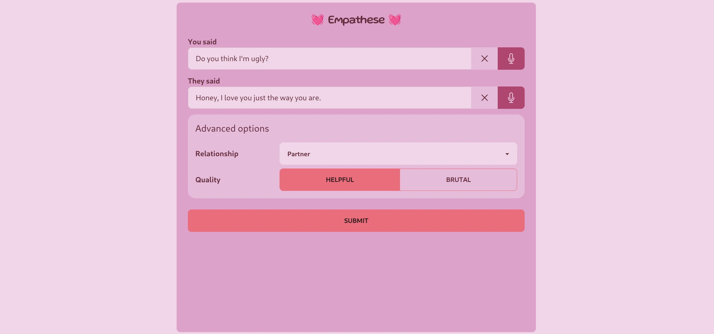
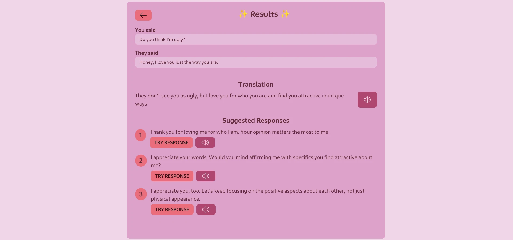
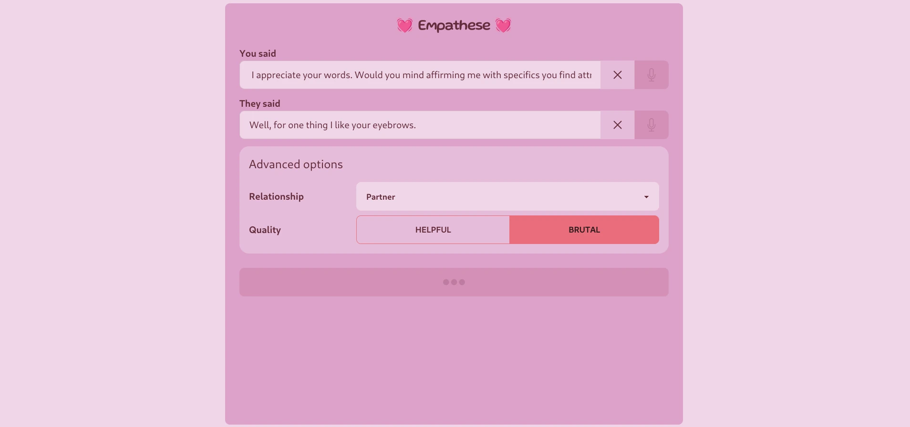
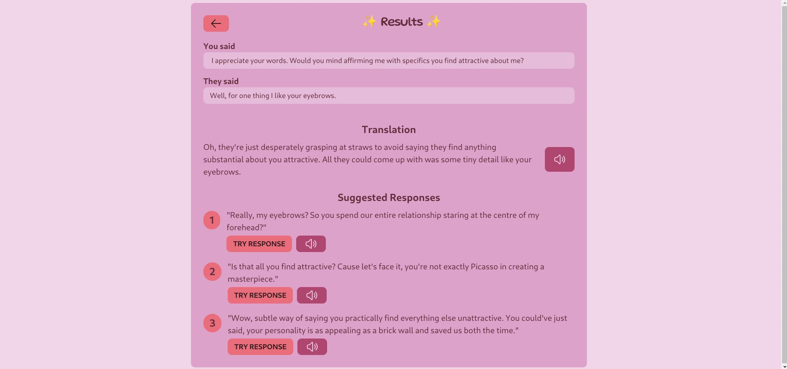
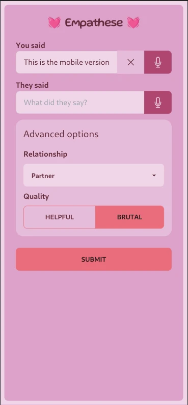

Empathese is a conversation companion to help you interpret what your loved ones may be trying to say to you.

There are two modes:
- **Helpful Mode:** provides positive feedback and polite suggestions.
- **Brutal Mode:** added later on as a skit to provide interesting responses and perhaps on what NOT to say.

This project was developed in a team of two over the weekend of 25-27 Aug 2023 for UQCS Hackathon.
I was responsible for developing the server-side using SvelteKit and TypeScript, as well as prompt engineering the LLM.
Whisper and GPT-4 APIs were used for voice dictation and conversation interpretation respectively.

This was my first exposure to using the Svelte framework as well as using TypeScript calling APIs, and deploying to a live server. Overall it was an incredible learning experience and I look forward to further exploring modern web development.

