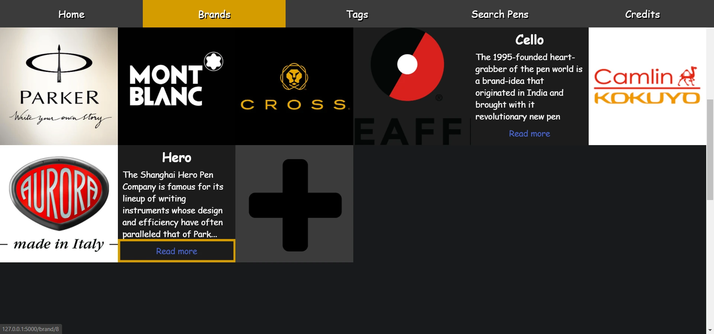
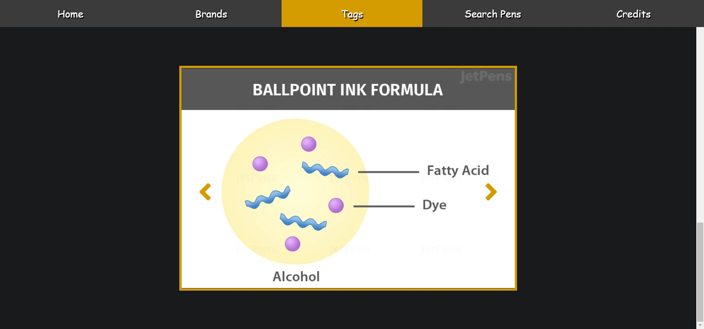
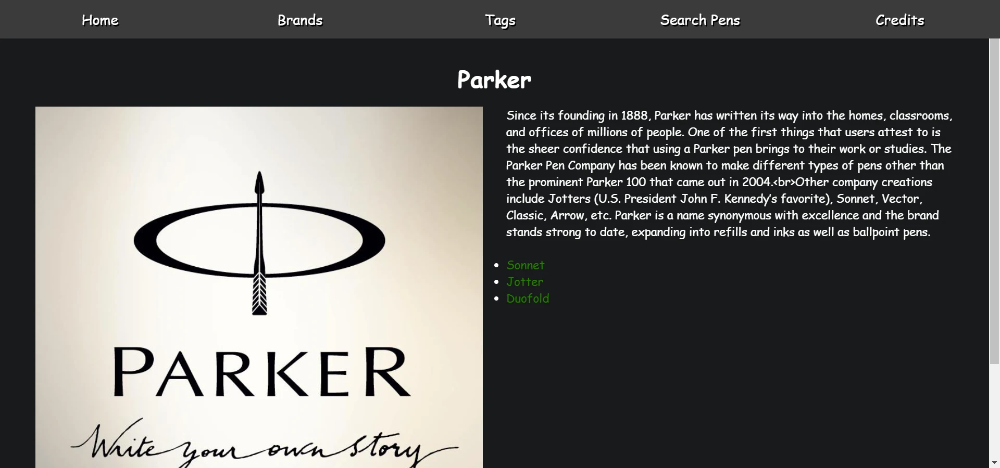
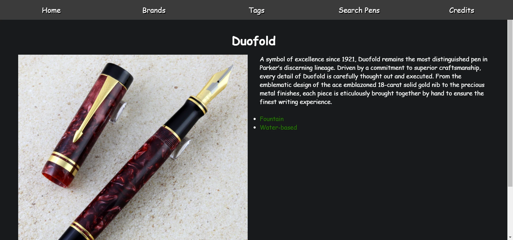
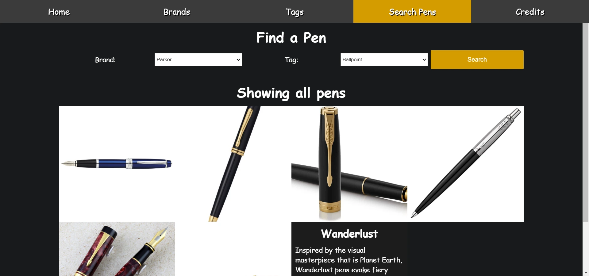
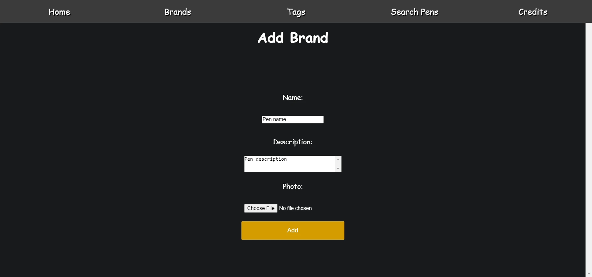

A Flask web server made in 2020 to store an online database of pens.
The purpose is to inform the user about different pens brands, pen features, and pens models.
There is a sample collection of brands, tags, and pens to showcase the website features.
The user is able to interact with the database by adding new brands or modifying/deleting existing ones.
Made using Python, Flask, SQLite, HTML/CSS, and JavaScript.

