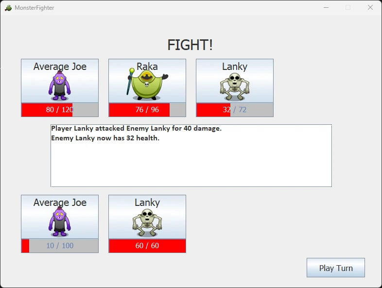
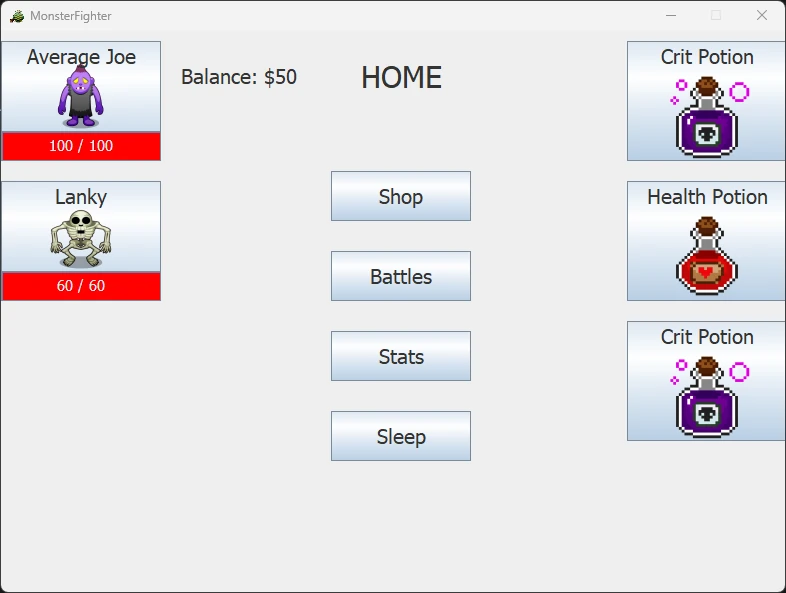
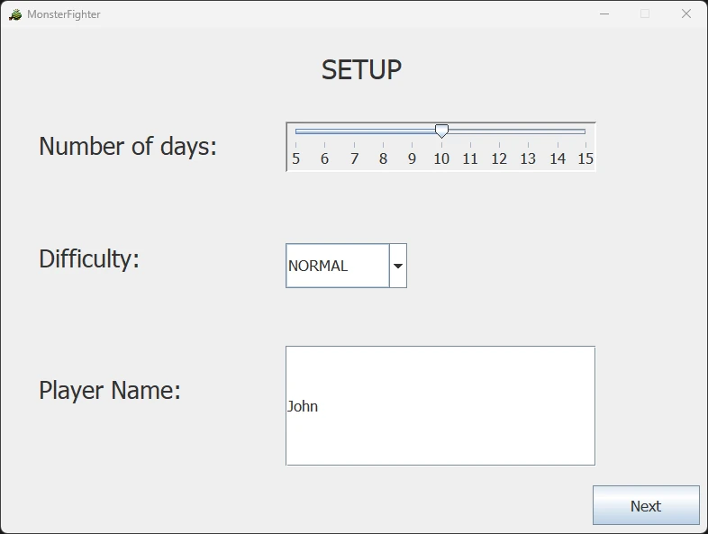
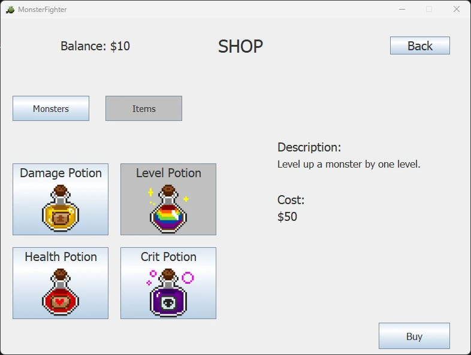
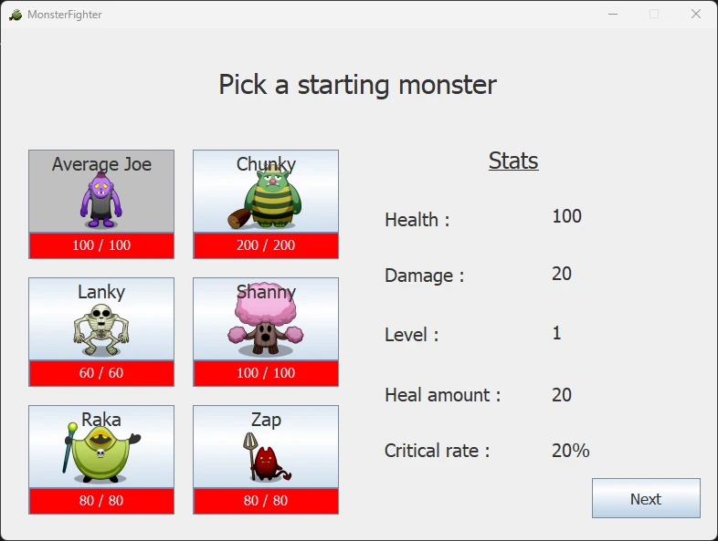

A turn-based player-vs-computer game made for Windows.
The goal is to fight the enemy monster teams while upgrading yours.
You have a limited number of days and must aim to achieve the best score by picking your fights carefully.
Made using Java and the Swing GUI Toolkit.

[Download Source Code + Java Executable](https://1drv.ms/u/s!AhCA5BqltFh3gXRSnwmdtV2jo2CH?e=8a8Qry)

