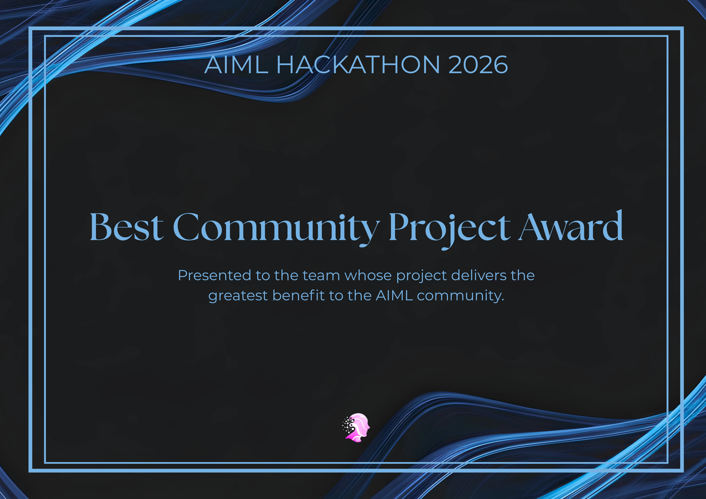
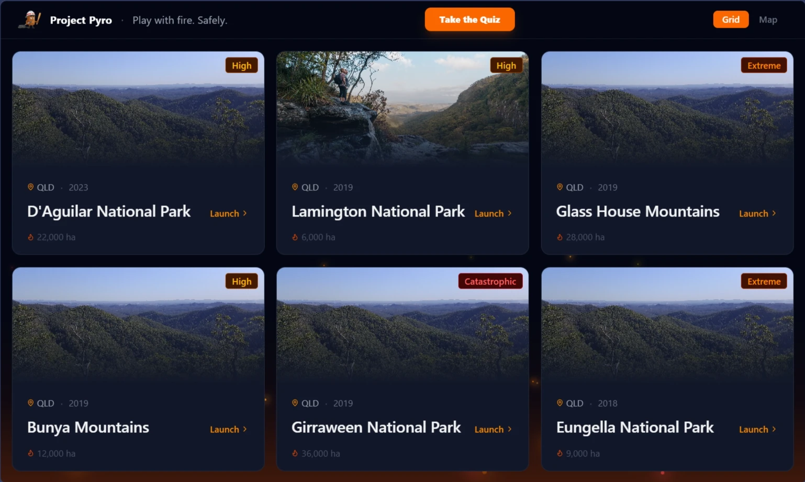
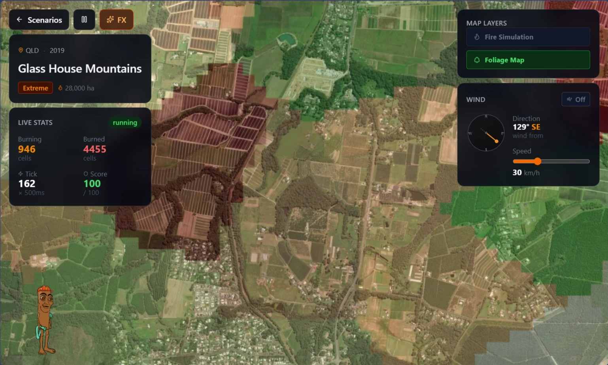
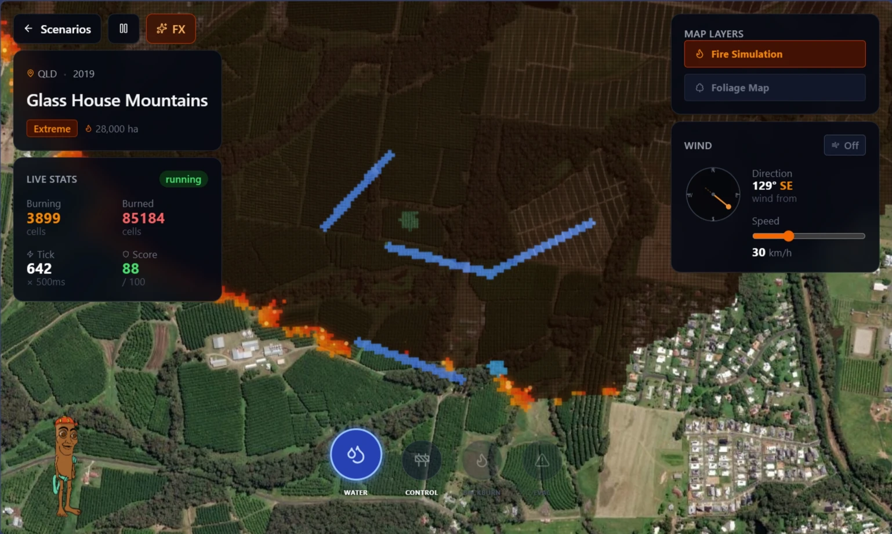
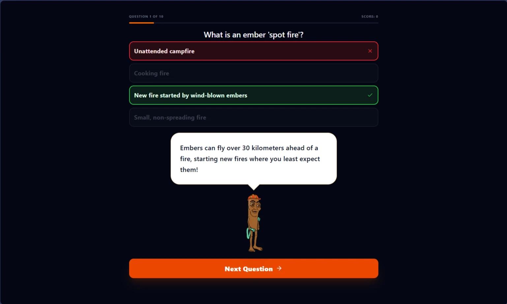

*Play with fire. Safely.*

Project Pyro is a browser-based wildfire simulation and education platform built for teens and young adults to develop environmental literacy and tactical thinking about fire behaviour. Instead of abstract textbooks, users fight actual Queensland bushfires on interactive satellite maps and learn real fire science as they play. Built in 48 hours for the **QUT AIML Hackathon 2026**, where it won the **Best Community Project Award**.





## The Problem

Wildfire science is abstract. Concepts like fire spread physics, ember spotting, fuel moisture, and suppression tactics are hard to visualise. We wanted to make that understanding tactile and immediate.

## Simulation Engine

The core is a client-side implementation of the **Alexandridis cellular automata model** running on a 1,000×1,000 cell grid at 10m resolution, covering a full 10×10 km area per scenario. Fire spread probability is calculated each tick using wind direction, wind speed, vegetation type, slope, and fuel moisture:

```
P_burn = P₀ · (1 + P_veg) · (1 + P_den) · P_w · P_s
```

Where the wind factor `P_w = exp(V · [0.045 + 0.131·(cos(θ)−1)])` biases spread 2.5× toward the downwind direction. Six real Queensland bushfires serve as playable scenarios, each locked to authentic satellite imagery and geographic bounds:

- **D'Aguilar National Park** (2023, 22,000 ha)
- **Glass House Mountains** (2019, 28,000 ha)
- **Girraween** (2019, 36,000 ha)
- **Bunya Mountains** (2019, 12,000 ha)
- **Lamington National Park** (2019, 6,000 ha)
- **Eungella** (2018, 9,000 ha)



## Suppression Tools

Players use three firefighting tactics to contain each fire before it consumes the map:

- **Water Drop** — 5×5 circular suppression, cells temporarily wetted for ~10 seconds, 3-second cooldown
- **Control Line** — two-click placement of a permanent firebreak (max 30 cells, 10-second cooldown)
A live stats panel tracks burning cells, area lost in hectares, current wind, and a score based on area saved vs. time.



## Visual Rendering

Fire, vegetation, and control overlays are rendered via custom HTML5 Canvas layers on top of React-Leaflet rather than DOM elements — necessary to handle a million-cell grid at 500ms ticks without freezing the browser. Grid state is stored in a ref (not React state) to avoid re-render overhead. A wind-drifted ember particle system (capped at 600 particles) and cell glow effects run alongside the simulation.

## Educational Layer

A 10-question randomised quiz covers fire behaviour science, Australian ecology, and survival tactics. A mascot character provides context-aware commentary throughout gameplay — reacting to water drops, wind changes, and victory/defeat — anchoring the educational content without breaking immersion.



## Backend & GIS Pipeline

The Python backend (FastAPI + Rasterio + GeoPandas) processes real ABS shapefiles and SRTM elevation data, transforming between EPSG:3577 and EPSG:4326 to align simulation cells with live satellite tiles. During the hackathon the frontend ran against a MockWebSocket client-side; the backend is wired to take over via a single URL swap in `useSimulation.js`.

## Tech Stack

- **Frontend:** React 18, Vite, React-Leaflet, HTML5 Canvas
- **Backend:** FastAPI, Python, NumPy, Rasterio, GeoPandas, SciPy
- **Data:** ABS state boundary shapefiles, SRTM elevation DEM, procedural Voronoi vegetation maps
- **Design:** Tailwind CSS v4, glassmorphic "Tactical Sentinel" UI — dark navy + incendiary orange
