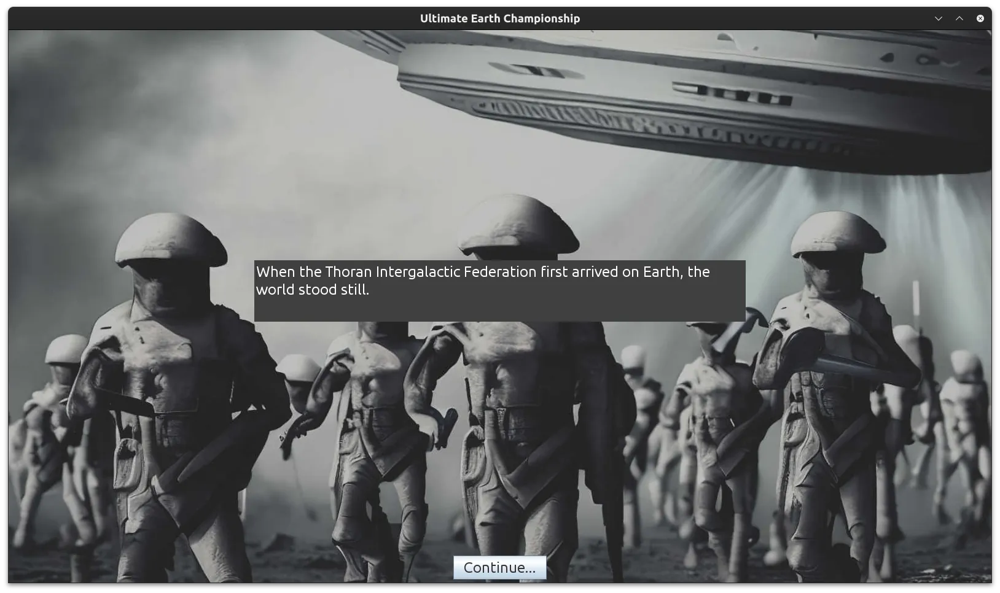
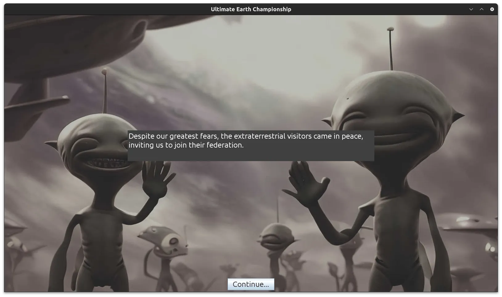
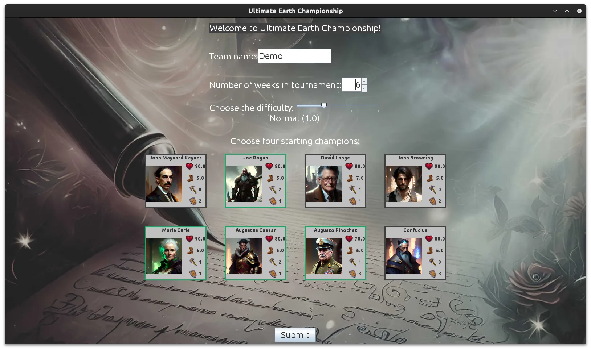
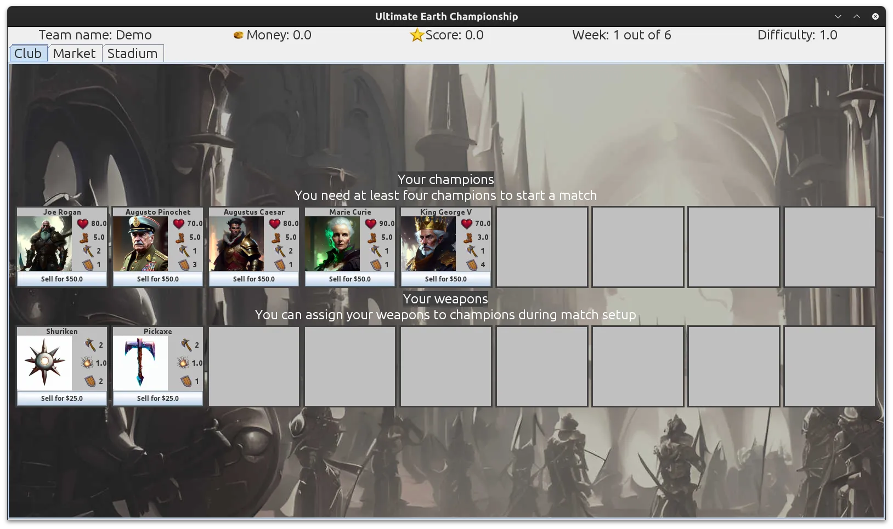
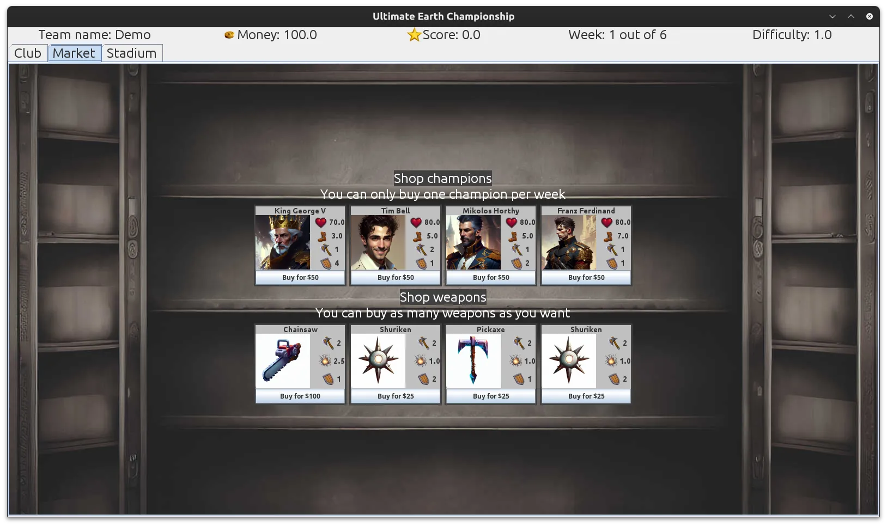
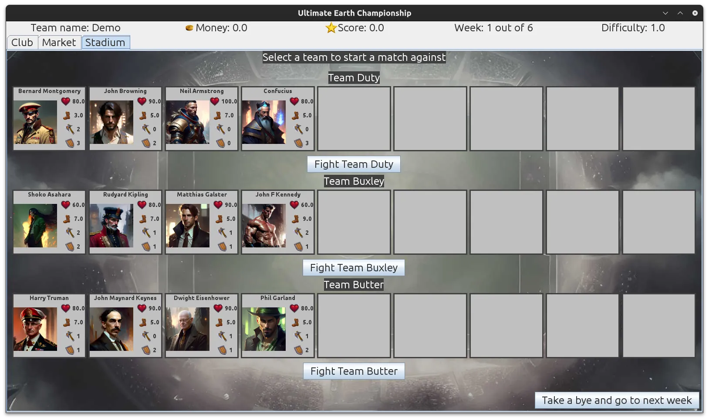
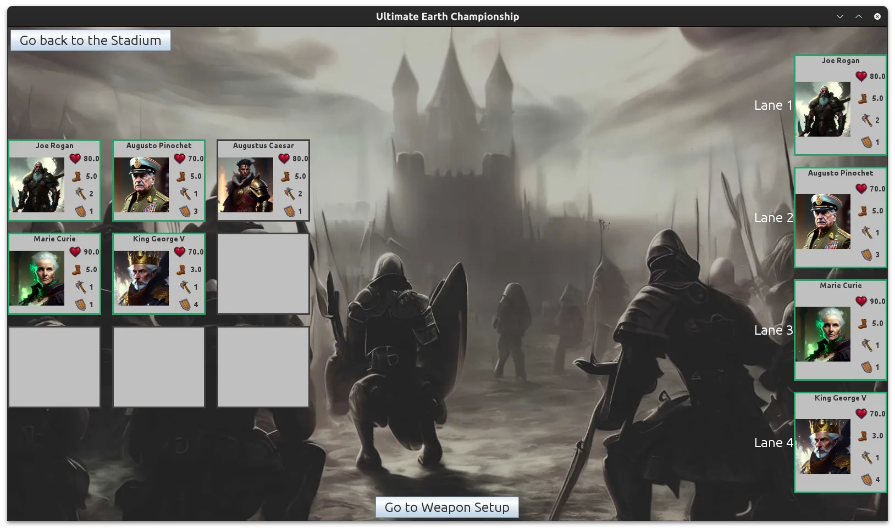
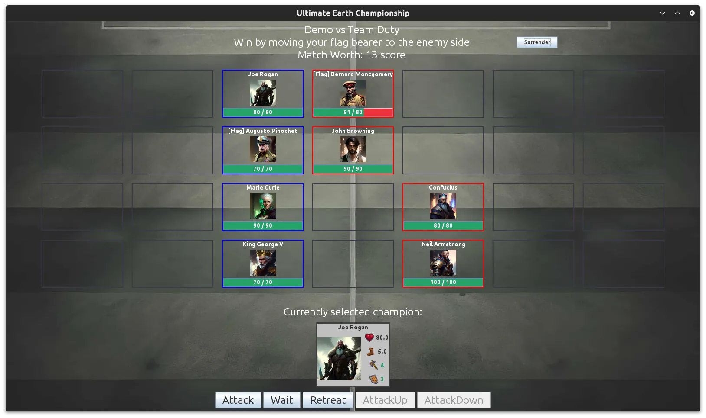

A turn-based player-vs-computer game made for Windows.

Aliens have invaded Earth and ressurected the greatest of humanity back to life to battle each other in the intergalactic sports tournament.
You are to create a team of up to 9 champions, provide them with weapons, and fight against other teams in a checkered style battle arena.
The other teams intelligently fight each other and make purchases from the market in the background to create a realistic battling system.

Made using Java with the Swing GUI Toolkit in the Eclipse IDE.
We utilized JUnit for unit testing and UML diagrams for planning.

### Folder Index
 - **UltimateEarthChampionship/** - Contains Eclipse project source code including unit tests
 - **doc/** - Contains compiled Javadoc documentation for the project
 - **uml/** - Contains UML use case and class diagrams in both PNG format
 - **Report.pdf** - Project report
 - **README.md** - The file containing instructions on how to open and run the project
 - **fha62_oco36_SportsTournament.jar** - Runnable jar file

