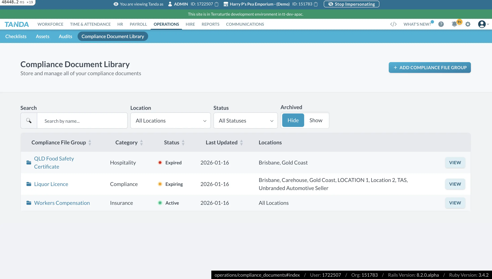
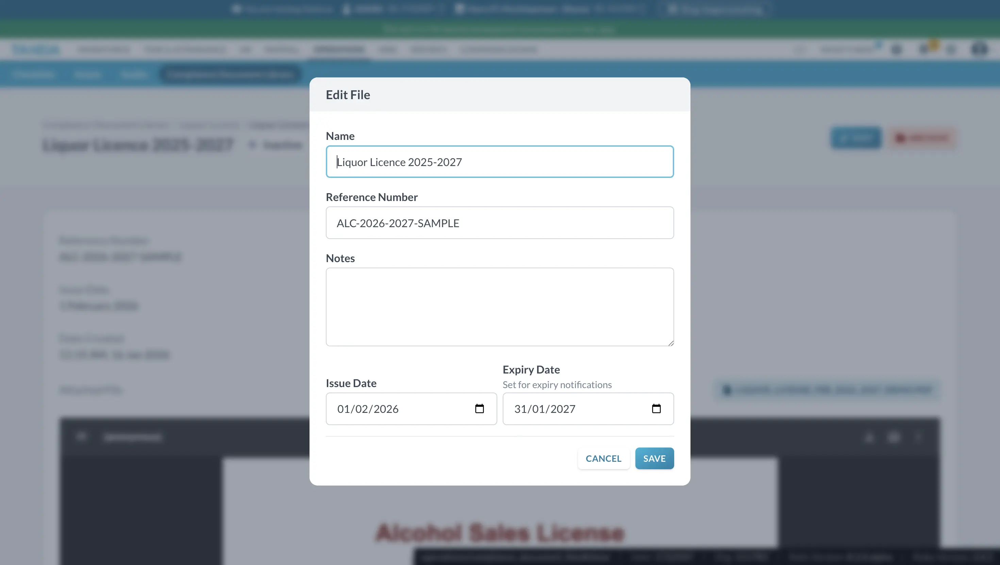
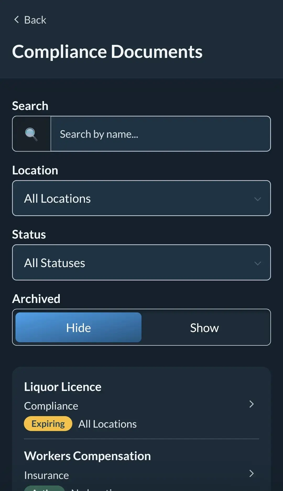
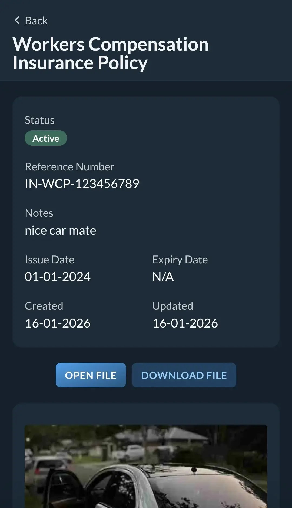

Between December 2025 and January 2026, I had the incredible opportunity to work as a Software Engineer Intern at **Tanda** in Brisbane. During this time, I was part of a focused two-person team responsible for architecting and deploying a brand new feature for the Tanda ecosystem.

## The Project: Compliance Document Library

The primary focus of my internship was the design and development of the **Compliance Document Library**. This application was built using **Ruby on Rails** and was designed to provide businesses with a secure, centralized way to store and manage critical compliance documents.

In the fast-paced world of workforce management, staying compliant is a major challenge for businesses. The library we built aimed to streamline this by:
- Enabling secure storage of sensitive documents.
- Implementing an intuitive management interface for business owners.
- Automating tracking and status updates.

## Key Responsibilities

As a Software Engineer Intern, I was deeply involved in every stage of the development lifecycle:

### 1. Database Schema & Architecture
I architected the database schema to ensure efficient data retrieval and scalability. Working with Ruby on Rails, I leveraged ActiveRecord to define clear relationships and constraints, ensuring the integrity of compliance data.

### 2. Automated Email Notifications
One of the most impactful features I developed was an automated email notification system. This system ensures that stakeholders are promptly informed of document status changes, upcoming expirations, and required actions, reducing the risk of non-compliance.

### 3. Quality & Testing
In a small, two-person team, code quality was paramount. I maintained high standards by:
- Writing comprehensive unit and integration tests.
- Participating in rigorous peer reviews.
- Adhering to Ruby on Rails best practices and idiomatic code patterns.

## Reflection

Working at Tanda was a transformative experience. Being part of a small team allowed me to take on significant responsibilities and see my code move from design to production rapidly. I learned the importance of clear communication, the power of a well-architected Rails application, and the impact of focused, high-quality engineering on real-world business problems.

---

### Gallery

*The desktop dashboard for the Compliance Document Library.*

*Implementing the document editing and management interface.*

*Ensuring a seamless mobile experience for document tracking.*

*Viewing specific compliance document details on mobile.*
